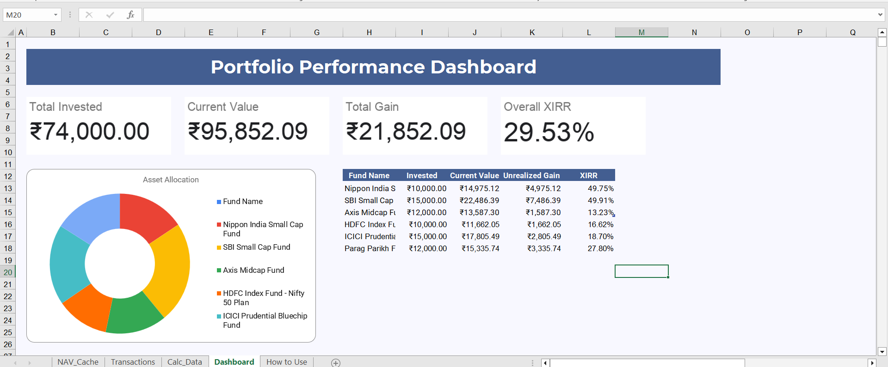

# Mutual Fund Portfolio Tracker

An **Excel-based Mutual Fund Portfolio Tracker & Performance Dashboard** designed to monitor investments, portfolio value, gains, fund-wise performance, and XIRR.

##  Key Features

* Total Invested & Current Portfolio Value
* Unrealized Gain/Loss Tracking
* Fund-wise Performance Analysis
* Portfolio Allocation Dashboard
* Transaction & NAV Tracking
* Overall XIRR Calculation

##  Tools Used

**Microsoft Excel | Excel Formulas | XIRR | VLOOKUP | SUMIF | Dashboard | Financial Analytics**

## Workbook Structure

* `Transactions` – Investment transaction data
* `NAV_Cache` – Latest NAV data
* `Calc_Data` – Portfolio calculations
* `Dashboard` – Visual portfolio performance
* `How to Use` – Usage instructions

##  Dashboard

##  Skills Demonstrated

**Data Analysis • Financial Analytics • Excel Modeling • Dashboard Development • Investment Analysis**

**Chandra Shekar**
